# Consortia Account and Network Automation

This Terraform module automates the creation and configuration of 2-5 child accounts from a root account, establishing a full mesh network topology with Besu, IPFS, and Paladin networks. **Full mesh connectivity is required for Paladin's P2P networking to enable selective disclosure use cases** where each node must be able to communicate directly with all other nodes.

> **Note**: This example supports 2-5 accounts due to Terraform's provider limitations. For larger deployments, extend this pattern or use multiple Terraform configurations with workspace-based approaches.

## Architecture Overview

### Account Structure and OAuth Bootstrap


### Network Types Per Account
- **Besu Network**: Ethereum blockchain with QBFT consensus
- **IPFS Network**: Distributed file storage  
- **Paladin Network**: Privacy-preserving transaction layer with P2P selective disclosure

### Originator vs Joiner Resources

```mermaid
graph LR
    subgraph ORIG ["🏛️ ORIGINATOR (node1)"]
        OB["🔗 Besu Network<br/>Validators + Peers<br/>init_mode: automated"]
        OI["📁 IPFS Network<br/>Shared swarm key<br/>Bootstrap node"]
        OP["🔒 Paladin Network<br/>Registry admin<br/>Deploy contract"]
        
        OBS["⚡ Besu Signers<br/>(Validators)"]
        OBP["🌐 Besu Peers<br/>(Connectable)"]
        OGW["🚪 EVM Gateway<br/>(API Access)"]
        
        OIS["📦 IPFS Service<br/>(File Storage)"]
        OPS["🛡️ Paladin Service<br/>(Privacy Layer)"]
        
        OS1["📊 Chain Infra Stack<br/>Besu"]
        OS2["📊 Chain Infra Stack<br/>IPFS"]
        OS3["📊 Chain Infra Stack<br/>Paladin"]
    end
    
    subgraph JOIN ["🏢 JOINERS (node2, node3, ...)"]
        JB["🔗 Besu Network<br/>Peers only<br/>init_mode: manual"]
        JI["📁 IPFS Network<br/>Same swarm key<br/>Connect to bootstrap"]
        JP["🔒 Paladin Network<br/>Existing registry<br/>Join network"]
        
        JBP["🌐 Besu Peers<br/>(Connectable)"]
        JGW["🚪 EVM Gateway<br/>(API Access)"]
        
        JIS["📦 IPFS Service<br/>(File Storage)"]
        JPS["🛡️ Paladin Service<br/>(Privacy Layer)"]
        
        JS1["📊 Chain Infra Stack<br/>Besu"]
        JS2["📊 Chain Infra Stack<br/>IPFS"]
        JS3["📊 Chain Infra Stack<br/>Paladin"]
    end
    
    style ORIG fill:#fff3e0
    style JOIN fill:#f3e5f5
    style OB fill:#ffecb3
    style OI fill:#e8f5e8
    style OP fill:#fce4ec
    style JB fill:#ffecb3
    style JI fill:#e8f5e8
    style JP fill:#fce4ec
```



### Full Mesh Network Topology

**Critical for Paladin P2P Selective Disclosure**: Every account connects to every other account.

```mermaid
graph TD
    subgraph MESH ["🕸️ FULL MESH CONNECTIVITY"]
        N1["🏛️ node1<br/>(Originator)"]
        N2["🏢 node2<br/>(Joiner)"]
        N3["🏢 node3<br/>(Joiner)"]
        N4["🏢 node4<br/>(Joiner)"]
        
        N1 -.->|"🔗 Besu<br/>📁 IPFS<br/>🔒 Paladin"| N2
        N1 -.->|"🔗 Besu<br/>📁 IPFS<br/>🔒 Paladin"| N3
        N1 -.->|"🔗 Besu<br/>📁 IPFS<br/>🔒 Paladin"| N4
        
        N2 -.->|"🔗 Besu<br/>📁 IPFS<br/>🔒 Paladin"| N1
        N2 -.->|"🔗 Besu<br/>📁 IPFS<br/>🔒 Paladin"| N3
        N2 -.->|"🔗 Besu<br/>📁 IPFS<br/>🔒 Paladin"| N4
        
        N3 -.->|"🔗 Besu<br/>📁 IPFS<br/>🔒 Paladin"| N1
        N3 -.->|"🔗 Besu<br/>📁 IPFS<br/>🔒 Paladin"| N2
        N3 -.->|"🔗 Besu<br/>📁 IPFS<br/>🔒 Paladin"| N4
        
        N4 -.->|"🔗 Besu<br/>📁 IPFS<br/>🔒 Paladin"| N1
        N4 -.->|"🔗 Besu<br/>📁 IPFS<br/>🔒 Paladin"| N2
        N4 -.->|"🔗 Besu<br/>📁 IPFS<br/>🔒 Paladin"| N3
    end
    
    subgraph LEGEND ["🔍 Connection Types"]
        REQ["📤 Platform Requestor<br/>(Initiates connection)"]
        ACC["📥 Platform Acceptor<br/>(Accepts connection)"]
        P2P["🔄 Bidirectional P2P<br/>(Full mesh for Paladin)"]
    end
    
    style N1 fill:#fff3e0
    style N2 fill:#f3e5f5
    style N3 fill:#f3e5f5
    style N4 fill:#f3e5f5
    style MESH fill:#e8f5e8
    style LEGEND fill:#fff
```



## Features

- ✅ **Automated Account Bootstrap**: Creates N child accounts with OAuth trust relationship
- ✅ **Kubernetes Service Account Integration**: Supports bearer token authentication from K8s
- ✅ **Full Mesh Topology**: Complete P2P connectivity for Paladin selective disclosure
- ✅ **Multi-Network Support**: Besu, IPFS, and Paladin networks per account
- ✅ **Chain Infrastructure Stacks**: All networks organized in `chain_infrastructure` stacks
- ✅ **User Group Management**: Default `users` group with `stack_access` permissions
- ✅ **Dynamic Scaling**: Configure 2-5 accounts with modular architecture
- ✅ **Network Connectors**: Automated request/accept connection flow with full mesh pattern
- ✅ **Submodular Design**: Joiner accounts and network connectors as reusable modules
- ✅ **Production Ready**: Configurable node counts, zones, and sizes

## Quick Start

### 1. Prerequisites

- Root account with OAuth provider configured
- Kubernetes cluster with service account for authentication
- Terraform with Kaleido provider

### 2. Basic Configuration

```hcl
# terraform.tfvars
child_account_count = 5
account_name_prefix = "node"
root_platform_bearer_token = "eyJhbGciOiJSUzI1NiIs..."
kaleido_id_client_id = "your_client_id"
kaleido_id_client_secret = "your_client_secret"
kaleido_id_config_url = "https://sso.your-domain.com/.well-known/openid-configuration"
first_user_email = "admin@your-domain.com"
deployment_zone = "platform-conn"
```

### 3. Deploy

```bash
terraform init
terraform plan -var-file="terraform.tfvars"
terraform apply -var-file="terraform.tfvars"
```

## Configuration Examples

### Small Development Setup (3 accounts)
```hcl
child_account_count = 3
originator_signer_count = 1
originator_peer_count = 1
paladin_node_size = "Medium"
```

### Enterprise Production Setup (5 accounts)
```hcl
child_account_count = 5
originator_signer_count = 4  # HA consensus
originator_peer_count = 3    # Multiple connectivity points
gateway_count = 1
paladin_node_size = "Large"
```

### High Performance Network (4 accounts)
```hcl
child_account_count = 4
originator_signer_count = 3
originator_peer_count = 2
paladin_node_size = "Large"
gateway_count = 1
```

## Network Connection Flow

### Full Mesh Connectivity (Required for Paladin P2P)
1. **Originator** (node1) creates Besu, IPFS, and Paladin networks with consensus/validator nodes
2. **Joiners** (node2-N) create their networks using originator's bootstrap data  
3. **All accounts** request connections to **all other accounts** for each network type
4. **All accounts** accept connection requests from all other accounts
5. **Result**: Complete full mesh topology with N × (N-1) total connections

### Connection Pattern by Network Type
- **Besu**: Full mesh for blockchain consensus and transaction propagation
- **IPFS**: Full mesh for distributed file storage and content addressing
- **Paladin**: **Critical full mesh** for P2P selective disclosure and privacy features

### Submodule Architecture
- **`joiner_account` module**: Creates infrastructure for each joiner account (node2-N)
- **`network_connectors` module**: Calculates and templates full mesh connection configuration
- **Main.tf**: Implements actual network connectors with proper provider scoping

## Resource Structure Per Account

```
Account (node1, node2, ..., nodeN)
├── Environment
├── Users Group (with stack_access)
├── Besu Network
│   ├── Chain Infrastructure Stack
│   ├── Signer Nodes (originator only)
│   ├── Peer Nodes
│   └── EVM Gateway (optional)
├── IPFS Network
│   ├── Chain Infrastructure Stack
│   └── IPFS Node
└── Paladin Network
    ├── Chain Infrastructure Stack
    └── Paladin Node Service
```

## Outputs

The module provides comprehensive outputs for operational visibility:

### Account Information
- Child account IDs, names, and API URLs
- Environment IDs and roles (originator vs joiner)
- OIDC configuration details

### Network Details
- Network IDs for Besu, IPFS, and Paladin
- Stack IDs and access control groups
- Service endpoints and node information

### Connectivity Status
- Network connector IDs and connection status
- Topology type (hub-spoke vs full-mesh)
- Total connection counts

### Operational Data
- Bootstrap data availability
- Service counts by type
- Stack access configurations

## Operational Considerations

### Security
- **OAuth Integration**: Child accounts inherit OAuth trust from root account
- **Kubernetes Service Account**: Bearer token authentication for automated deployments
- **Stack Access Control**: Users group automatically granted read_write access to all stacks
- **Network Isolation**: Each account has separate networks with controlled connectivity

### Scalability
- **Node Counts**: Configurable signer and peer node counts for originator
- **Account Limits**: Tested with up to 20 child accounts
- **Zone Deployment**: All peerable nodes deployed in specified deployment zone
- **Resource Sizing**: Configurable Paladin node sizes (Small/Medium/Large)

### High Availability
- **Multiple Signers**: Configure multiple signer nodes for consensus redundancy
- **Multiple Peers**: Configure multiple peer nodes for connectivity redundancy
- **Gateway Redundancy**: Optional EVM gateways for API access
- **Force Delete**: Configurable for development vs production scenarios

### Monitoring and Troubleshooting
- **Network Bootstrap**: Originator bootstrap data propagated to all joiners
- **Connection Status**: Network connector status available in outputs
- **Service Health**: All service IDs exposed for monitoring integration
- **Dependency Management**: Proper resource dependencies ensure correct deployment order

## Advanced Configuration

### Custom Validation Policies
```hcl
custom_validation_policy = <<EOF
package custom_validation
import future.keywords.in

default allow := false

# Custom validation logic here
allow {
    input.id_token.custom_claim == "allowed_value"
}
EOF
```

### Custom Initial Balances
```hcl
initial_balances = {
  "0x742d35Cc6634C0532925a3b8D21fDaF37CAbc883" = "0x111111111111"
  "0x8ba1f109551bD432803012645Hac136c9341041e" = "0x222222222222"
}
```

### Tagging Strategy
```hcl
common_tags = {
  Environment = "production"
  Project     = "enterprise-blockchain"
  Owner       = "blockchain-team"
  CostCenter  = "IT-BLOCKCHAIN"
}
```

## Troubleshooting

### Common Issues

1. **Bootstrap Data Not Available**
   - Ensure originator signer nodes are fully deployed before joiners
   - Check `bootstrap_data.originator_bootstrap_available` output

2. **Connection Failures**
   - Verify deployment zone configuration
   - Check network connector status in outputs
   - Ensure proper OAuth configuration

3. **Authentication Issues**
   - Verify bearer token validity and Kubernetes service account permissions
   - Check OAuth provider configuration and client credentials

4. **Resource Creation Timeout**
   - Increase Terraform timeout for large deployments
   - Consider deploying in stages (originator first, then joiners)

### Validation Commands
```bash
# Check account creation
terraform output child_accounts

# Verify network topology  
terraform output network_topology

# Check connection status
terraform output network_connections

# Validate service endpoints
terraform output service_endpoints
```

## Integration Examples

### With Kubernetes
```yaml
apiVersion: v1
kind: Secret
metadata:
  name: kaleido-config
data:
  bearer-token: <base64-encoded-token>
  client-id: <base64-encoded-client-id>
  client-secret: <base64-encoded-client-secret>
```

### With CI/CD Pipeline
```yaml
steps:
  - name: Deploy Kaleido Infrastructure
    run: |
      terraform init
      terraform apply -var-file="$ENVIRONMENT.tfvars" -auto-approve
      terraform output -json > kaleido-outputs.json
```

### With Monitoring
```bash
# Extract service endpoints for monitoring
terraform output -json service_endpoints | jq '.value.originator_services'
```

## Cost Optimization

- **Gateway Count**: Set to 0 if EVM access not needed
- **Node Sizing**: Use "Small" Paladin nodes for development
- **Account Count**: Start with minimum viable topology and scale up
- **Full Mesh**: Only enable for development or small networks (cost grows as N²)

## Support and Contributing

For issues, feature requests, or contributions:
1. Check existing Kaleido documentation
2. Review Terraform provider documentation
3. Submit issues with full configuration and error details
4. Include `terraform output deployment_summary` in support requests